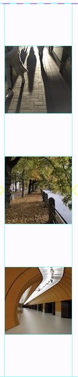

# 

# Tugas 9
##  Jelaskan mengapa kita perlu membuat model untuk melakukan pengambilan ataupun pengiriman data JSON? Apakah akan terjadi error jika kita tidak membuat model terlebih dahulu?

Pembuatan model dari suatu data JSON berguna untuk merepresentasikan dan mengatur data secara efisien. Belum tentu akan terjadi error jika tidak dibuat model terlebih dahulu, tetapi data akan lebih konsisten dan kesalahan akan lebih sedikit jika menggunakan model.

##  Jelaskan fungsi dari library *http* yang sudah kamu implementasikan pada tugas ini

http library digunakan untuk komunikasi antara Flutter dan server. Ini membolehkan Flutter untuk mengirim HTTP request, serta meng-handle status respons dari server. 

##  Jelaskan fungsi dari CookieRequest dan jelaskan mengapa *instance* CookieRequest perlu untuk dibagikan ke semua komponen di aplikasi Flutter.

CookieRequest berfungsi untuk mengelola cookies pada suatu sesi autentikasi. CookieRequest digunakan di semua komponen aplikasi agar sesi autentikasi pengguna tetap terjaga dan tidak perlu login ulang setiap pergantian page.

##  Jelaskan mekanisme pengiriman data mulai dari input hingga dapat ditampilkan pada Flutter.

- Pengguna menginput data pada form yang diberikan pada aplikasi Flutter.
- Data dikirim ke server Django melalui HTTP request dalam format JSON.
- Server memproses data via validasi atau menyimpan ke database, lalu mengirim kembali ke Flutter.
- Data yang telah divalidasi diparse oleh Flutter lalu ditunjukkan ke pengguna.

##  Jelaskan mekanisme autentikasi dari login, register, hingga logout. Mulai dari input data akun pada Flutter ke Django hingga selesainya proses autentikasi oleh Django dan tampilnya menu pada Flutter.

- Autentikasi bermulai dari register yang mengirim data akun ke endpoint register di Django, dan disimpan setelah validasi.
- Saat login, kredensial login dikirim ke endpoint login Django. Jika valid, akan mengembalikan cookie sesi.
- Jika login berhasil, aplikasi mengambil data yang sesuai dengan pengguna pada server lalu menampilkannya.
- Logout dilakukan dengan mengirim permintaan ke endpoint logout. Jika berhasil, cookie sesi akan dihapus.

##  Jelaskan bagaimana cara kamu mengimplementasikan *checklist* di atas secara *step-by-step*! (bukan hanya sekadar mengikuti tutorial).

- Start app authentication baru pada project Django
- Menambahkan INSTALLED_APPS dan konfigurasi settings.py lainnya
- Membuat function login, register, dan logout pada views.py authentication
- Membuat page login dan register pada aplikasi Flutter
- Menambahkan CookieRequest pada setiap page aplikasi
- Menyocokkan url agar bisa mengirim HTTP request dengan benar
- Membuat model dari JSON data Django
- Membuat page list Product dan page detail Product

# Tugas 8

## Apa kegunaan `const` di Flutter? Jelaskan apa keuntungan ketika menggunakan `const` pada kode Flutter. Kapan sebaiknya kita menggunakan `const`, dan kapan sebaiknya tidak digunakan?

`const` digunakan ketika nilai suatu variabel sudah diketahui sejak *compile time* dan tidak akan berubah. Penggunaan `const` sebenarnya hanya memberi tahu *compiler* bahwa variabel tidak akan berubah, maka hanya perlu membuat 1 salinan dari variabel tersebut, lalu dapat di-*reference* terus menerus pada 1 salinan tersebut. Ini berguna karena jika tanpa `const`, suatu *object* di-*mention* berulang-ulang kali, meskipun untuk setiap *mention* itu *object* bernilai sama, akan menggunakan banyak *memory*.

Selain itu menghemat *memory*, `const` juga memberi tahu Flutter bahwa suatu *object* tidak perlu di-*rebuild* karena tidak akan berubah. Sehingga *performance* app akan lebih baik secara keseluruhan.

## Jelaskan dan bandingkan penggunaan *Column* dan *Row* pada Flutter. Berikan contoh implementasi dari masing-masing layout widget ini!

Widget `Column` digunakan untuk menyusun widget secara vertikal, sedangkan widget `Row` digunakan untuk menyusun widget secara horizontal. Keduanya bisa memiliki suatu list child widgets. Child widget tersebut bisa juga berupa widget `Row`, `Column`, atau widget kompleks lainnya. *Alignment* dan *stretch/constrain* suatu child widget dapat dispesifikasikan.

Contoh implementasi `Row`:
Row(
  mainAxisAlignment: MainAxisAlignment.spaceEvenly,
  children: [
    Image.asset('images/pic1.jpg'),
    Image.asset('images/pic2.jpg'),
    Image.asset('images/pic3.jpg'),
  ],
);

Contoh implementasi `Column`:
Column(
  mainAxisAlignment: MainAxisAlignment.spaceEvenly,
  children: [
    Image.asset('images/pic1.jpg'),
    Image.asset('images/pic2.jpg'),
    Image.asset('images/pic3.jpg'),
  ],
);

## Sebutkan apa saja elemen input yang kamu gunakan pada halaman *form* yang kamu buat pada tugas kali ini. Apakah terdapat elemen input Flutter lain yang tidak kamu gunakan pada tugas ini? Jelaskan!

Saya menggunakan `TextFormField` untuk semua field yang dibutuhkan pada form (*name, description, amount, and price of product*) agar user bisa input field via text yang diketik. Untuk fields amount dan price, ada restriksi input, yaitu hanya input numerik yang valid, serta field tidak boleh null. Sedangkan untuk fields name dan description, restriksinya hanya bahwa field tidak boleh null.

Ada elemen input Flutter lain yang tidak saya gunakan, beberapa di antaranya:

`Radio()` : Digunakan untuk memberikan pilihan antara beberapa *value* yang *mutually exclusive*;

`Checkbox()` : Bisa menunjukkan jika *value true* atau *false*;

`Slider()` : Memberikan pilihan pada suatu *range value*;

dan lain sebagainya.

## Bagaimana cara kamu mengatur tema (theme) dalam aplikasi Flutter agar aplikasi yang dibuat konsisten? Apakah kamu mengimplementasikan tema pada aplikasi yang kamu buat?

Tema aplikasi pada Flutter dapat didefinisikan pada file `main.dart` dan dapat digunakan secara konsisten pada seluruh bagian aplikasi dengan mendefinisikan theme dan men-*detail* tema yang diinginkan dalam `ThemeData` pada `MaterialApp`. Tema ini lalu dapat digunakan di seluruh aplikasi dengan menggunakan method `Theme.of(context)` ketika memberi spesifikasi pada suatu widget. Method ini akan mencari ke widget tree lalu mengambil tema terdekat yang ada. Jika tema tidak didefinisikan, Flutter memiliki tema *default* yang akan digunakan.

Saya pribadi baru hanya mendefinisikan warna utama yang digunakan pada aplikasi dan belum menerapkan tema yang konsisten karena belum memikirkan desain yang cocok.

## Bagaimana cara kamu menangani navigasi dalam aplikasi dengan banyak halaman pada Flutter?

Untuk mengimplementasikan navigasi pada aplikasi Flutter, ada sistem yang cukup lengkap untuk melakukan navigasi antar page. Salah satu cara yang dapat digunakan untuk berpindah page  adalah dengan menggunakan *widget* `Navigator`. *Widget* `Navigator` menampilkan page-page yang ada dalam sebuah *stack*. Untuk menavigasi sebuah page baru, `Navigator` dapat diakses melalui `BuildContext` dan memanggil method-method `Navigator`, seperti `push()`, `pop()`, serta `pushReplacement()`.

Method `push()` menambahkan suatu *route* ke dalam *stack* *route* yang dikelola oleh `Navigator`. Method ini menyebabkan *route* yang ditambahkan berada pada paling atas stack, sehingga *route* yang baru saja ditambahkan tersebut akan muncul dan ditampilkan kepada pengguna.

Method `pop()` menghapus *route* yang sedang ditampilkan kepada pengguna (atau dalam kata lain, *route* yang berada pada paling atas *stack*) dari *stack* *route* yang dikelola oleh Navigator. Method ini menyebabkan aplikasi untuk berpindah dari *route* yang sedang ditampilkan kepada pengguna ke *route* yang berada di bawahnya pada *stack* yang dikelola `Navigator`.

Method `pushReplacement()` menghapus *route* yang sedang ditampilkan kepada pengguna dan menggantinya dengan suatu *route*. Method ini menyebabkan aplikasi untuk berpindah dari *route* yang sedang ditampilkan kepada pengguna ke suatu *route* yang diberikan. Pada *stack* *route* yang dikelola `Navigator`, *route* lama pada atas *stack* akan digantikan secara langsung oleh *route* baru yang diberikan tanpa mengubah kondisi elemen *stack* yang berada di bawahnya.

Walaupun `push()` dan `pushReplacement()` sekilas terlihat mirip, namun perbedaan kedua *method* tersebut terletak pada apa yang dilakukan kepada *route* yang berada pada atas *stack*. `push()` akan menambahkan *route* baru diatas *route* yang sudah ada pada atas *stack*, sedangkan `pushReplacement()` menggantikan *route* yang sudah ada pada atas *stack* dengan *route* baru tersebut. Penting juga untuk memperhatikan kemungkinan urutan dan isi dari *stack*, karena jika kondisi *stack* kosong serta kita menekan tombol **Back** pada gawai, maka sistem akan keluar dari aplikasi tersebut.

# Tugas 7

## Jelaskan apa yang dimaksud dengan *stateless widget dan stateful widget*, dan jelaskan perbedaan dari keduanya.

*Stateless widget* adalah *widget* yang tidak mempunyai *state* dan tidak pernah berubah dengan sendirinya. Perubahan *stateless widget* terjadi melalui *parent widget* di *widgets tree*. Contoh *stateless widget* adalah `Icon`, `IconButton`, dan `Text`.
*Stateful widget* bersifat dinamis. Wujudnya bisa berubah-ubah sebagai *response* interaksi pengguna ketika menerima data. Contoh *stateful widget* adalah `Checkbox`, `Radio`, `Slider`, `Form`, dan `TextField`.

## Sebutkan *widget* apa saja yang kamu gunakan pada proyek ini dan jelaskan fungsinya.

`MyHomePage` adalah *widget* yang berfungsi sebagai *container* untuk menunjukkan semua elemen yang dibutuhkan pada *home page*.
`ItemCard` adalah *widget* untuk *button cards*: penampilannya dan apa yang terjadi ketika *button-button* tersebut di-*click*. 

## Apa fungsi dari `setState()`? Jelaskan variabel apa saja yang dapat terdampak dengan fungsi tersebut.

Suatu *widget state* disimpan pada *object* `State`, memisahkan *state* suatu *widget* dengan penampilannya. `State` terdiri atas nilai-nilai yang bisa berubah, seperti posisi terakhir `slider` atau apakah suatu `checkbox` telah di-*check*. Ketika *widget state* berubah, `setState()` dipanggil untuk memberi tahu *framework* bahwa *internal state* dari *widget* telah berubah.

`setState()` akan menjadwalkan `build` agar *widget* sesuai dengan perubahan *state*. Jika `setState()` tidak digunakan ketika *state* berubah, *framework* belum tentu akan mengalokasi waktu untuk *rebuild* dan wujud *widget* bisa saja tidak sesuai dengan *state* barunya.

## Jelaskan perbedaan antara `const` dengan `final`.

`final` berarti *single-assignment*: suatu variabel `final` harus memiliki inisialisasi. Setelah di-*assign* dengan suatu nilai, nilai variabel `final` tidak bisa diubah-ubah. `final` memodifikasi variabel.

`const` berarti *deep state* suatu *object* dapat ditentukan pada *compile time* dan *object* akan *frozen* dan *immutable*. `const` memodifikasi *values*.

Object `const` memiliki beberapa sifat dan restriksi:
1. Harus dibuat dari data yang bisa dihitung pada *compile time*. *Object* `const` tidak bisa mengakses apapun yang perlu dihitung pada *runtime*.
2. *Object* bersifat *immutable*. Jika ada *final field* yang berisi *collections*, *collection* itu masih bisa *mutable*. Jika ada `const` *collection*, semua di dalamnya harus `const` pula, secara rekursif.
3. Object telah di-*canonicalized*. Mirip seperti *string-interning*, untuk setiap `const` value, suatu object `const` akan dibuat dan digunakan ulang. Contoh:

`getConst() => const [1, 2];`
`main() {`
`var a = getConst();`
`var b = getConst();`
`print(a === b); // true`
`}`

## Jelaskan bagaimana cara kamu mengimplementasikan *checklist-checklist* di atas.

- Membuat *repository git* baru.
- Men-*generate project flutter* baru pada folder repo dan mengetes dengan `flutter run`.
- Menerapkan *clean architecture* dengan membuat file baru `menu.dart` pada folder /lib *project*.
- Modifikasi *widget MyHomePage* dari `stateful` menjadi `stateless`.
- Membuat *button cards* dengan membuat *classes* baru `ItemHomepage` dan `ItemCard`.
- Membuat *list* warna yang akan digunakan untuk *button*.
- Set button agar menunjukkan `snackbar` ketika di-*click*.
- Membuat README dan menjawab pertanyaan-pertanyaan.
